# Assignment 1
Name: Gabriel Gjini

Legi-Nr: 15-932-437

## Required results
Edit this 'README.md' file to report all your results. You only need to update the tables in the reports section by adding screenshots and reporting results.

### Tasks
- Add a text dump of the content of the two data structures for the provided mesh “plane.off”.

- Show three screenshots of the 'fandisk.off' model using 'per-face shading', 'per-vertex shading' and 'per-corner shading'. Describe the difference between them.

- Show screenshots of the provided meshes with each connected component colored differently. Show the number of connected components and the size of each component (measured in number of faces) for all the provided models.

- Show screenshots of the subdivided meshes.

## Reports
### text dump of the data structure for "plane.off"
|VertexId|Vertices-to-Face       | Vertices-to-Vertex  |
|:-:| :-------------------- |:------------------- |
| 0 | 5 21                  | 11 13 22            |
| 1| 31                    | 9 12                |
| 2| 10 26                 | 10 15 23            |
| 3| 0                     | 14 16               |
| 4| 14 27 30              | 9 10 20 24          |
| 5| 13 23 29              | 11 12 19 24         |
| 6| 1 4 17                | 13 14 18 21         |
| 7| 2 8 18                | 15 16 17 21         |
| 8| 6 9 12 19 22 25       | 17 18 19 20 22 23   |
| 9| 15 30 31              | 1 4 12 24           |
|10| 11 26 27              | 2 4 20 23           |
|11| 7 21 23               | 0 5 19 22           |
|12| 15 29 31              | 1 5 9 24            |
|13| 4 5 20                | 0 6 18 22           |
|14| 0 1 16                | 3 6 16 21           |
|15| 8 10 24               | 2 7 17 23           |
|16| 0 2 16                | 3 7 14 21           |
|17| 3 8 9 18 19 24        | 7 8 15 18 21 23     |
|18| 3 4 6 17 19 20        | 6 8 13 17 21 22     |
|19| 7 12 13 22 23 28      | 5 8 11 20 22 24     |
|20|1 11 12 14 25 27 28    | 4 8 10 19 23 24     |
|21| 1 2 3 16 17 18        | 6 7 14 16 17 18     |
|22| 5 6 7 20 21 22        | 0 8 11 13 18 19     |
|23| 9 10 11 24 25 26      | 2 8 10 15 17 20     |
|24| 13 14 15 28 29 30     | 4 5 9 12 19 20      |

### Show three screenshots of the 'fandisk.off' model using different shading. Make sure you disable the wireframe and that the screenshots clearly show the differences between the different shading types.
| model name  | per-face shading    | per-vertex shading |  per-corner shading |
| :---------: | ------------------- | ------------------ | ------------------- |
| fandisk     |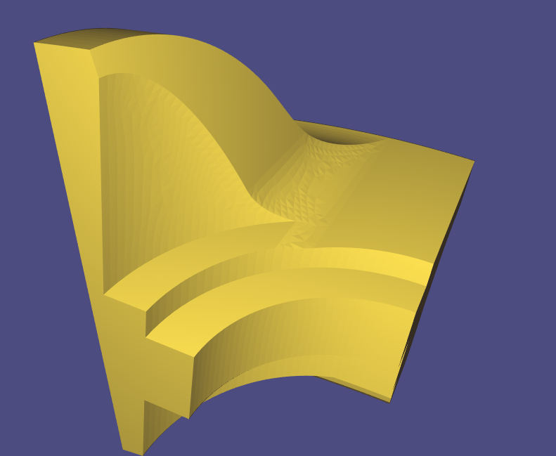| 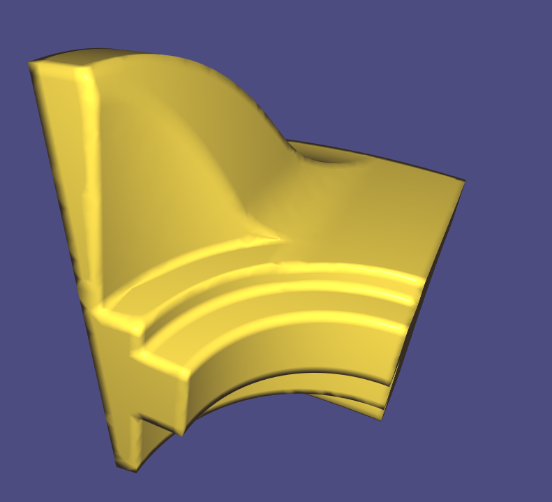 |  |

#### Briefly describe the difference between the different shading types.
Per-face shading makes the mesh have very clear-cut edges. This is explained by the method refracting light off of faces. This has the disadvantage that if the mesh has too few faces, discontinuity between neighboring facesis becomes clearly visible and also unwanted edges are clearly displayed . In the first picture above we can clearly see the triangles in the rounded areas. 

Per-vertex shading displays, in contrast to that, very smooth surfaces. This is due to the averaging that is done when coloring the vertices. Curved sufraces are thus displayed very smoothly. However, clear-cut edges are now also rounded as we can clearly see in the second picture above.

Lastly, with just the right threshold, per-corner shading combines the best of the former two methods. Curved surfaces are displayed very smoothly without any visual artifacts. At the same time, there is no blurring at the edges. With a very small or very large threshold, this method approaches per-face shading and per-vertex shading, respectively.

### Assign different colors to each connected component
| model name   | your results                                                  |  no. of components | no. of faces per component |
| :----------: | ------------------------------------------------------------  |:-----------------: | :------------------------: |
|bumpy_cube    |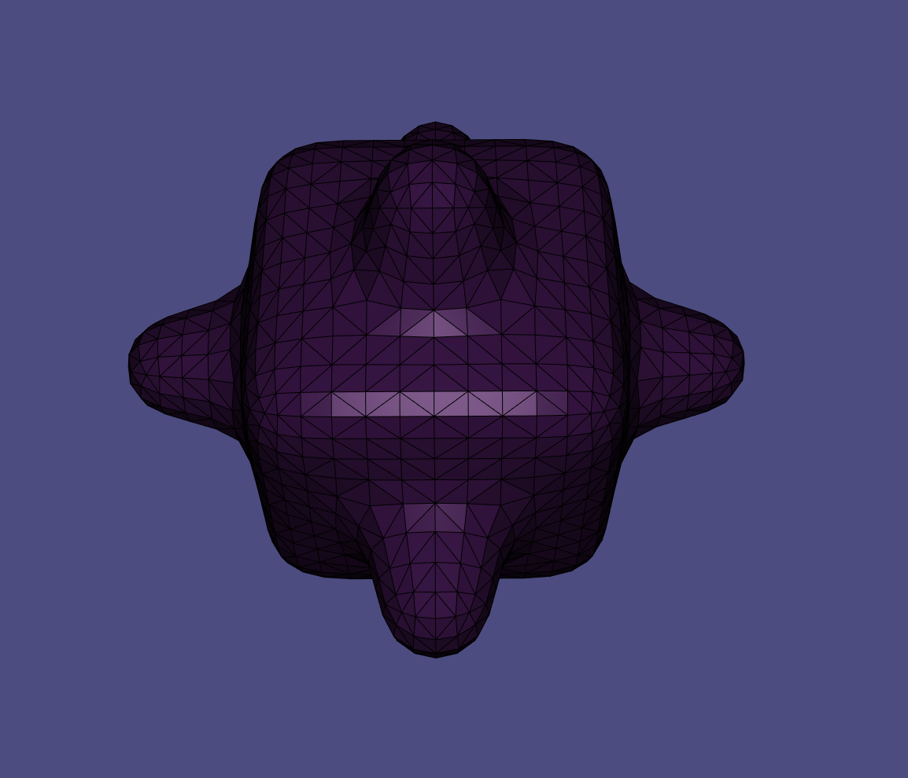  |   1                |  2496               |
|bunny         |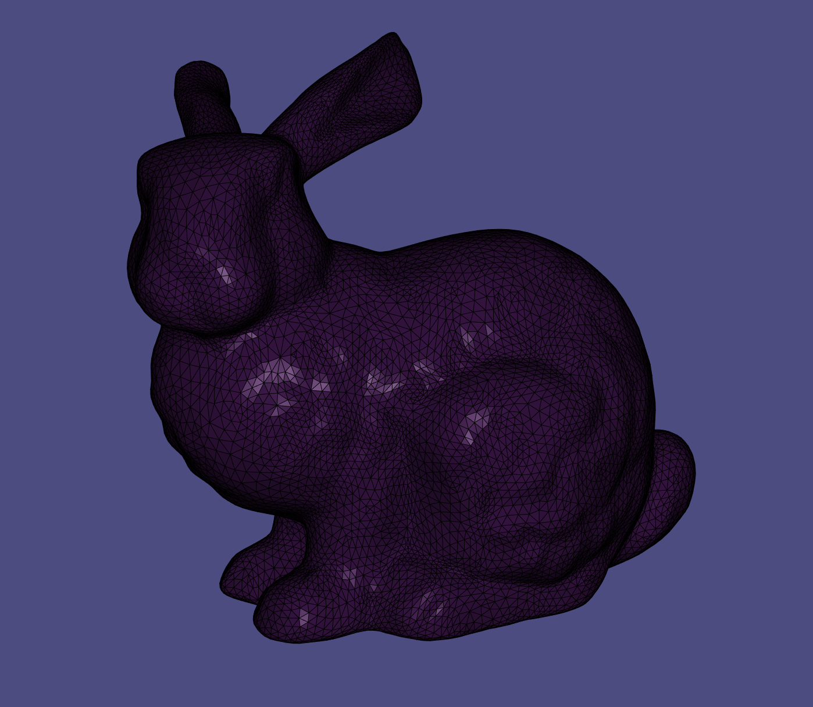  |   1                |  27864                 |
|coffeecup     |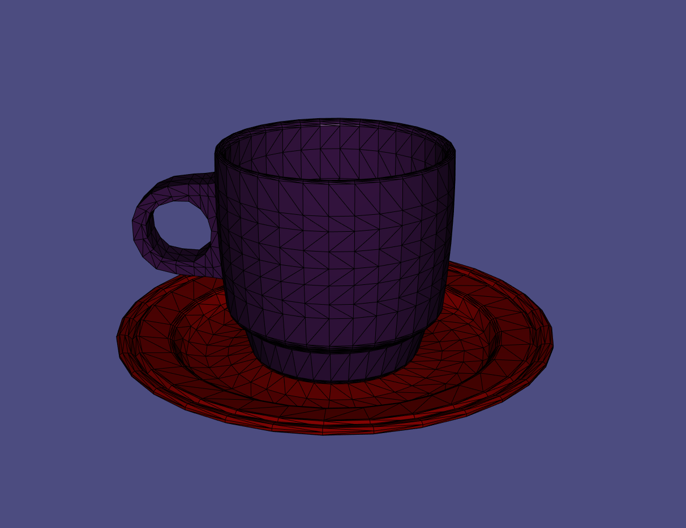  |   2                |  3360/2304                 |
|honda         |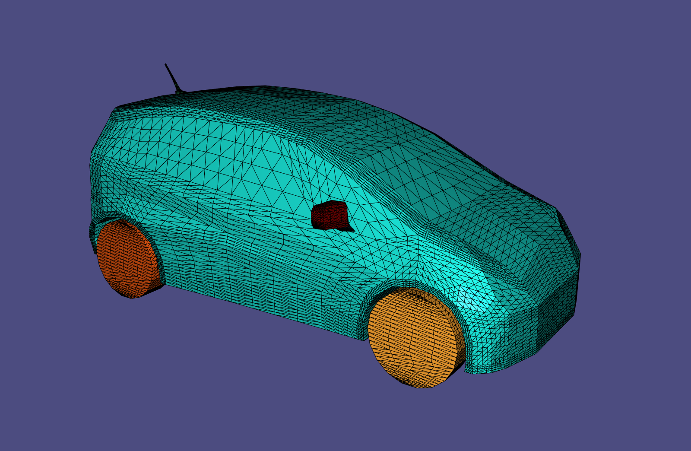  |   11               | 90/192/192/13216/704/1088/1088/1088/1088/736/736 |

### Screenshots of subdivided meshes. Make sure you enable the wireframe overlay.

| model name | original shape                                               | subdivided shape                                             |
| :--------: | ------------------------------------------------------------ |------------------------------------------------------------- | 
| plane      |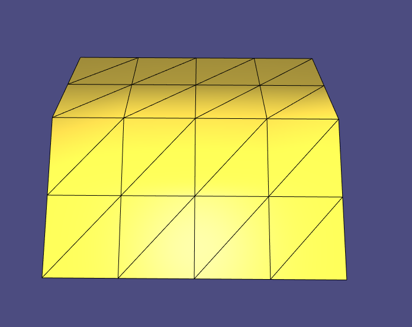 |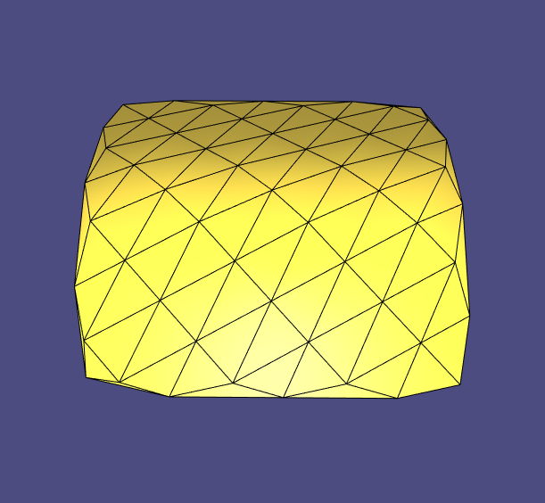 |
| sphere     |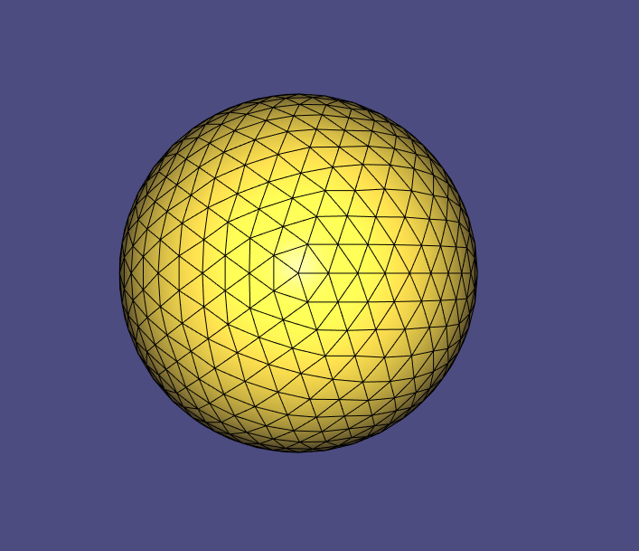 |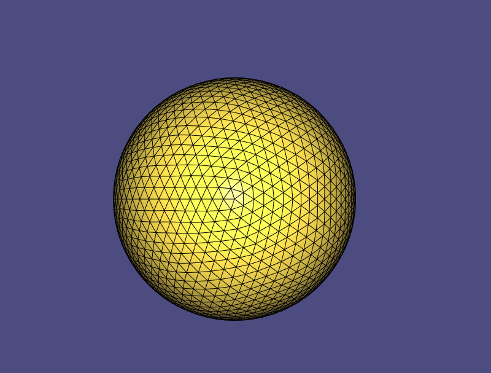 |
| bunny      |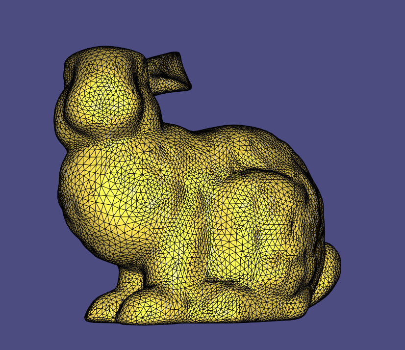 |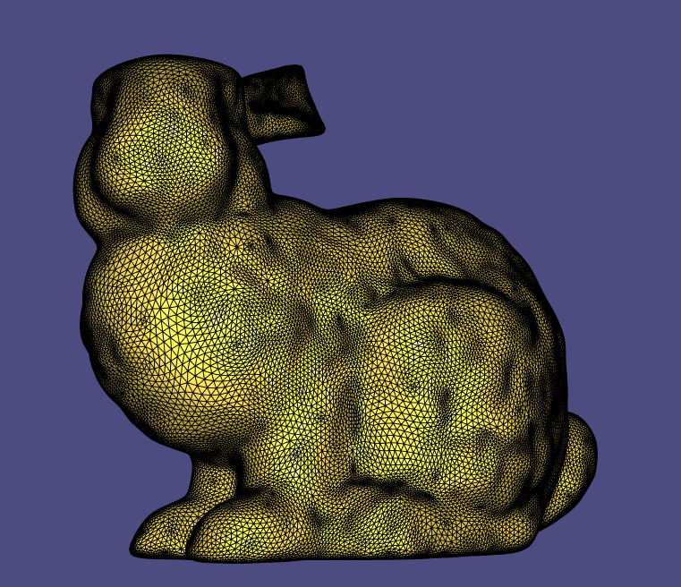 |
| bumpy_cube |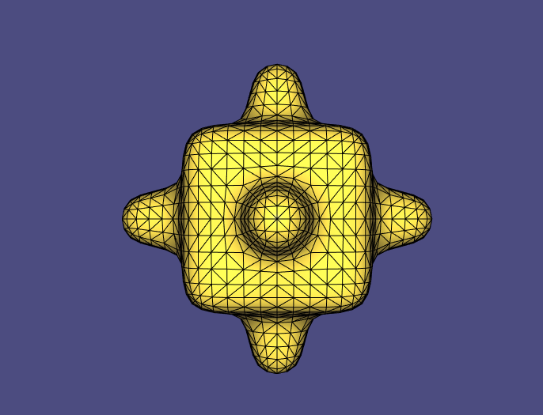 |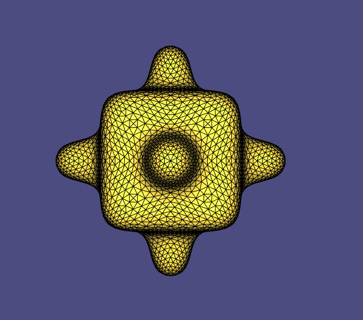 |

