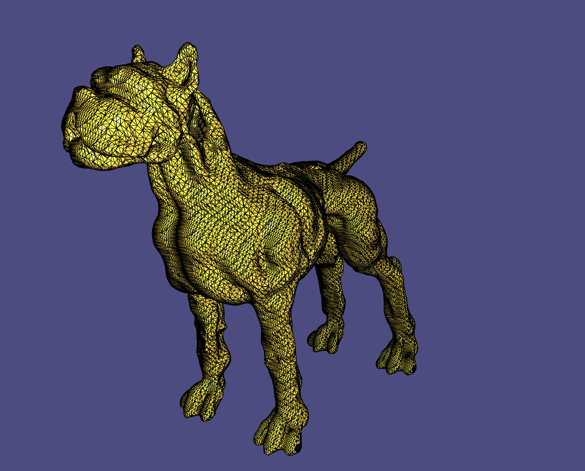
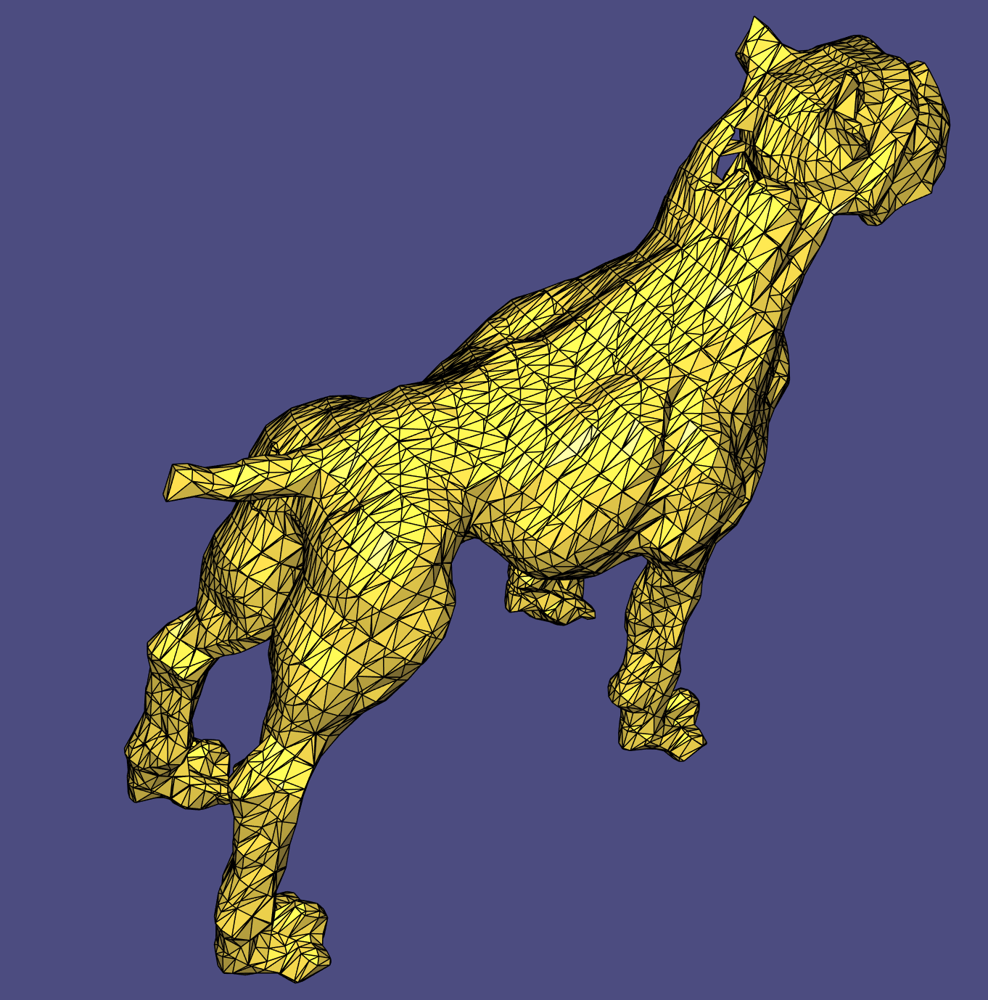

# Assignment 2
Name: Gabriel Gjini

Legi-Nr: 15 932 437

## Required results
Edit this 'README.md' file to report all your results. You only need to update the tables in the reports section by adding screenshots and reporting results.

### Tasks
1) Show the visualization of the constrained points for the 'cat.off' point cloud.

2) Show screenshots of the grid with nodes colored according to their implicit function values (cat.off and luigi.off).

3) Show screenshots of the reconstructed surfaces. Experiment with different parameter settings: grid resolution (also anisotropic in the 3 axes), Wendland function radius, polynomial degree. Add all these settings to the GUI to ease experimentation. Briefly summarize your observations and save the reconstructed models in the .off format for every point-cloud dataset provided (assignment2/results).

4) Theory question (1): Save your notes to assignment2/results and link to them from within the report.

5) Theory question (2): Save your notes to assignment2/results and link to them from within the report.

6) Show screenshots comparing the 'hound.off' computed with normal-based reconstruction to the point-based reconstruction of the previous task.

7) Compare your MLS reconstruction results to the surfaces obtained with RIMLS and Screened Poisson Reconstruction, and inspect the differences. Report your findings.

8) Show screenshorts of your method for estimating normals based on Principal Component Analysis. Compare the results with the reconstruction obtained using the provided normals.

## Reports
### 1 - Visualization of the 'cat.off' point cloud with constrained points
| model name  | view 01             | view 02            |
| :---------: | ------------------- | ------------------ |
| cat         ||  |

### 2 - Grid with nodes colored w.r.t. the implicit function (using the non-axis-aligned grid as described in Section 2.3) 
| model name  | view 01             | view 02            |
| :---------: | ------------------- | ------------------ |
| cat         ||  |
| luigi      ||  |

### 3 - Reconstructed surfaces
**Please also save the reconstructed shape (.off) in the results folder**

| sphere                                                     | cat                                                           |
| :--------------------------------------------------------: |  :----------------------------------------------------------: | 
||  |
| luigi                                                      | horse                                                         |
||  |
| hound                                                      |                                                               |
||                                                               |

**Please summarize your observations of what happens when you change the following parameters. Please feel free to add screenshots (by creating a separate table) to illustrate your explanation.**

| params                   | Your Observation    | 
| :---------------------:  | ------------------- |
| grid resolution          |   A grid resolution that is too small will result in a coarse grid and thus  oversimplified surfaces that only approximate the pointcloud very roughly. Once the grid is fine enough that it captures all details of the pointcloud (and the underlying surface), increasing the grid size will not add any details to the reconstructed surface but only increase the computation time.            |
| Wendland function radius |   A Wendland function radius that is too small will obviously lead to regions where only few points lie within the radius of a query point. This results in a surface with holes. On the other hand, having a very large Wendland radius will lead to a surface that is too smooth and especially insensitive to local details. In addition to this, the Wendland radius influences the runtime. With a large radius, every query point's SDF will be influenced by more points and thus lead to a bigger system having to be solved.               |
| polynomial degree        |   From experiments it can be observed that a lower polynomial degree (0 or 1) gives better results in terms of smoothness of the obtained surface. While intuitively a higher degree polynomial would give a better local fit to the pointcloud, in practice it introduces a lot of artifacts and an unsmooth result. An explanation for this is the numerical unstability introduced by the larger MLS system. Also, with a higher degree polynomial, this linear system of equations is more likely to be under-constrained with the same Wendland-Radius and consequently at the borders of the surface.              |

**Please compare the computation time for constraints computation and MLS using brute force and a spatial index. Use hound.off for the comparison and use the same parameters for the timings with and without use of spatial index (please report the parameters that you used).**

With Resolution = 30, polynomial degree = 0, and WendlandRadius = 0.02 we get the following measurements:
| step                    | brute force         |  spatial index      |
| :---------------------: | :-----------------: | :-----------------: |
| constraints             |   681 ms              |    117 ms             |
| MLS                     |   1619 ms              |    149 ms             |

### 4 - Theory Question 1

**Prove that the normal of a surface defined by an implicit function is proportional to its gradient.**

### 5 - Theory Question 2

**Compute the closed-form gradient of the MLS approximation.**

skipped

### 6 - Normal-based v.s. point-based reconstruction ("hound.off")
| method       | view 01             | view 02            | comments           | 
| :---------:  | ------------------- | ------------------ | ------------------ |
| point-based  ||  | The point-based approach has the shortcoming that for query points that are far away from other points, the offset constraints cancel each other out. One artefact can be seen around the neck of the hound. |
| normal-based ||  | The normal-based approach is a generalization of point-based approach that uses MLS to blend between linear functions instead of constant values. We can see that this leads to the filling of the hole in the neck of the hound.  |

### 7 - MLS v.s. Screened Poisson Reconstruction v.s. RIMLS

**No implementation required, you can use [Meshlab](https://www.meshlab.net) to perform the comparisons.**

| model names  | 
MLS
| 
Possion
 | 
RIMLS
| 
| :---------:  | :---------:  | :-----------------: | :-----------------: |
| cat          ||  | |
| luigi        ||  | |
| comments        | The MLS method delivers a very smooth surface. This leads to the fact that it fails to capture certain details, e.g. at the front of the hat of luigi. Similar behaviour can be observed at the cat's ears. | The screened Poisson method assumes the surface given as the isosurface of an indicator function. This leads to a very tight fit of the pointcloud which can be observed with luigi's cap or the cat's ears. Furthermore, the regions where there are few points get approximated very smoothly and leave not artifacts, such as the upper body of the cat. | We can see that the surfaces reconstructed using RIMLS are very robust against outliers. While luigi especially has some noise well outside the desired surface, this method manages to ignore it and obtain a nice surface.  |

### 8 - PCA normals v.s. provided normals (luigi.off)

| model names  |   
PCA normals
           |    
Provided normals
     | 
| :---------:  | :---------------------: | :---------------------: |
| luigi        |  |  |
| comments        | We use PCA and select as normals points which are perpendicular to the principal component of the pointcloud. Since there are infinitely many such perpendicular vectors, we choose one arbitrarily. This has the effect that at certain points at the boundary the regions get skewed to one side, especially at the regions where the normals switch from pointing to the positive to pointing to the negative direction. This effect can be observed at the nose of luigi. | The provided normals were presumably obtained during acquisition of the points and thus represents the true normals of the original surface very closely.    |
